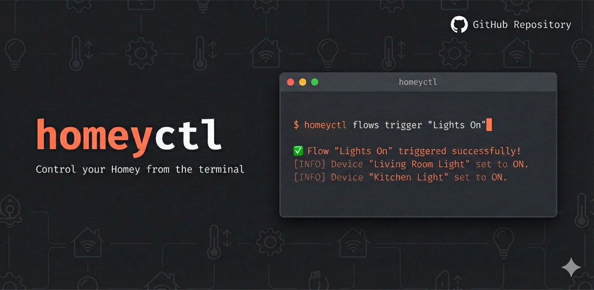

# homey-cli



A command-line interface for controlling [Homey](https://homey.app) smart home devices via the local API.

## Installation

### Homebrew (macOS/Linux)

```bash
brew tap langtind/tap
brew install homey-cli
```

### Download Binary

Download from [Releases](https://github.com/langtind/homey-cli/releases) and add to your PATH.

### Build from Source

```bash
go install github.com/langtind/homey-cli@latest
```

## Configuration

### 1. Find your Homey's IP address

Open the Homey app → Settings → General → scroll down to find the local IP address (e.g., `192.168.1.100`).

### 2. Get your API token

1. Go to [my.homey.app](https://my.homey.app/)
2. Log in and select your Homey
3. Click **Settings** (gear icon, bottom left)
4. Click **API Keys**
5. Click **+ New API Key** to create a new token
6. Copy the generated token

### 3. Configure homey-cli

```bash
# Set your Homey's IP address
homey config set-host 192.168.1.100

# Set your API token (paste the token you copied)
homey config set-token <your-token>

# Verify configuration
homey config show
```

Configuration is stored in `~/.config/homey-cli/config.toml`.

## Usage

### Devices

```bash
# List all devices
homey devices list

# Get device details
homey devices get "Living Room Light"

# Control devices
homey devices set "Living Room Light" onoff true
homey devices set "Living Room Light" dim 0.5
homey devices set "Thermostat" target_temperature 22

# Delete a device
homey devices delete "Old Device"
```

### Flows

```bash
# List all flows
homey flows list

# Get flow details
homey flows get "My Flow"

# Trigger a flow
homey flows trigger "Good Morning"

# Update a flow (partial/merge update)
homey flows update "My Flow" updated-flow.json

# Delete a flow
homey flows delete "Old Flow"

# List available flow cards (for creating flows)
homey flows cards --type trigger
homey flows cards --type condition
homey flows cards --type action
```

#### Creating Flows

Create flows from JSON files. See `homey flows create --help` for full documentation.

```bash
# Create a simple flow
homey flows create my-flow.json

# Create an advanced flow
homey flows create --advanced my-advanced-flow.json
```

Example flow JSON (turn on heater when user arrives and temperature is low):

```json
{
  "name": "Heat office on arrival",
  "trigger": {
    "id": "homey:manager:presence:user_enter",
    "args": {
      "user": {"id": "<user-id>", "name": "User Name"}
    }
  },
  "conditions": [
    {
      "id": "homey:manager:logic:lt",
      "droptoken": "homey:device:<device-id>|measure_temperature",
      "args": {"comparator": 20}
    }
  ],
  "actions": [
    {"id": "homey:device:<device-id>:on", "args": {}},
    {"id": "homey:device:<device-id>:target_temperature_set", "args": {"target_temperature": 23}}
  ]
}
```

Note: For droptokens, use pipe (`|`) before capability name.

### Users

```bash
# List users (useful for getting user IDs for flows)
homey users list
```

### Zones

```bash
# List zones
homey zones list

# Delete a zone
homey zones delete "Unused Room"
```

### Apps

```bash
# List installed apps
homey apps list

# Restart an app
homey apps restart com.some.app
```

### Energy

```bash
# Show live power usage
homey energy live

# Show today's energy report
homey energy report day

# Show report for specific date
homey energy report day --date 2025-01-10

# Weekly and monthly reports
homey energy report week
homey energy report month --date 2025-12

# Show electricity prices (dynamic)
homey energy price

# Set fixed electricity price (e.g., Norgespris 0.50 kr/kWh)
homey energy price set 0.50

# Get/set price type (fixed, dynamic, disabled)
homey energy price type
homey energy price type fixed
```

### Insights

```bash
# List all insight logs
homey insights list

# Get historical data for a log
homey insights get "homey:device:abc123:measure_power"

# With different resolutions
homey insights get "homey:device:abc123:measure_power" --resolution lastWeek
```

### Variables

```bash
# List logic variables
homey variables list

# Get/set variable
homey variables get "my_variable"
homey variables set "my_variable" 42

# Create/delete variable
homey variables create "new_var" number 0
homey variables delete "new_var"
```

### Notifications

```bash
# Send notification to Homey timeline
homey notifications send "Hello from CLI"

# List notifications
homey notifications list
```

### System

```bash
# System info
homey system info

# Reboot Homey (use with caution)
homey system reboot
```

## Output Formats

```bash
# JSON output (default)
homey devices list

# Table output
homey devices list --format table

# Set default format
homey config set-format table
```

## AI Assistant Support

Get context for AI assistants (Claude, ChatGPT, etc.) to help them use homey-cli:

```bash
homey ai
```

This outputs documentation, examples, and flow JSON format - perfect for pasting into an AI chat or including in your project's context.

## Environment Variables

All config options can be set via environment variables:

```bash
export HOMEY_HOST=192.168.1.100
export HOMEY_TOKEN=your-token
export HOMEY_FORMAT=table
```